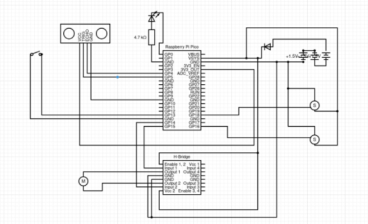

# Useless Box Project
## Hero Shot of Final Product

## Concept 
The **Useless Box** is a playful and interactive toy box that reacts to the outer movements. As its core, the toy box takes **defense mechanisms**, preventing any attempts to turn on the LED that is attached to the lid of the box. This can be achieved through a combination of mechanical movement, motion sensing, sound effects that make the interaction almost feel like a playful battle between human and machine.\
The concept builds on the idea of **unpredictability and persistence**. The endless loop of interaction makes the user feel challenged, entertained, and curious to see what happens next. Hence, the toy box is more than just a simple gadget but an engaging experience that showcases **human-machine interactions** in a fun way.
## Features
* Motion sensing and defense mechanism against user input
* LED indicator that resists being turned on
* Playful and unpredictable reactions
* Endless loop of interaction between human and machine
## Process of idea realization
### Plan and design
* Define the overall structure and components needed
* Sketch a design layout, including the placement of the arm, lid mechanism, and movement system.

  
### Select components/materials 
| Item No. | Item Name | Quantity | Description |
|----------|---------- |----------|--------------|
| 1        | Rasberry Pi Pico| 1|                |
| 2        | USB Cable     | 1|                  |
| 3        | Big breadboard     | 1|             |
| 4        | LEDs     | 1         |Transparent   |
| 5        | Resistors     | 1    |10K/230       |
| 6        | Brushed DC Motor|1   |GEARMOTOR 200 RPM 3-6V DC|
| 7        | Micro Servo Motor|2  |SERVO MOTOR RC 4.8V|
| 8        | Toggle switch     | 1|              |
| 9        | Ultrasonic sensor| 1 |              |
| 10       | Battery holder| 1    |4 AAA batteries|
| 11       | Jumper cables | 12   |M-M/F-M|
| 12       | Tape     | 1         |              |
| 13       | Hot glue stick| 1    |              |
### Mechanical Assembly
* Prototype:
  * smaller-scale box (for curf testing)
 
     
  * normal-scale box

      
* Build the box using laser cutting
* Install the servo motors for the lid, arm, and rotation mechanism

  
* Secure the motion sensor in positions where it can effectively detect outer movements.  
### Electronic Integration
* Electronic diagram

  
* Connect components to the microcontroller: the switch and LED are linked to the input-output pins; servo motors and motion sensors are properly programmed

  
* Making sure that the power supply is efficient for all components
### Programming and Logic Integration
* Write the code to handle:
  * Switch activation and LED control 
  * The toy’s arm extending to turn off the switch Motion sensor detection responses (opening the lid, popping out the toy, playing sounds)
  * Rotation of the box when several attempts are made.
### Testing
* Carry out multiple tests to ensure smooth operation  
## Technologies Used
* Hardware: Arduino / microcontroller, sensors (motion/IR), LED, servo motors, toy box structure
* Software: Embedded C / Arduino code for controlling sensors, motors, and LED
* Fabrication: 3D printing, laser cutting, simple woodworking (depending on build)
## How to Use
1. Power on the Useless Box.
2. Try to switch on the LED attached to the lid.
3. Watch as the box resists, moves, or reacts to your attempts.
4. Repeat endlessly—the box never gives up!
## Future Improvements
* Add sound effects for a more immersive experience
* Implement multiple difficulty levels or randomized defense behaviors
* Improve mechanical design for smoother movements
## Acknowledgement
Inspired by the classic “Useless Machine” concept, reimagined as a **smart, playful, and interactive** toy to explore **human–machine interaction** in a fun way.

